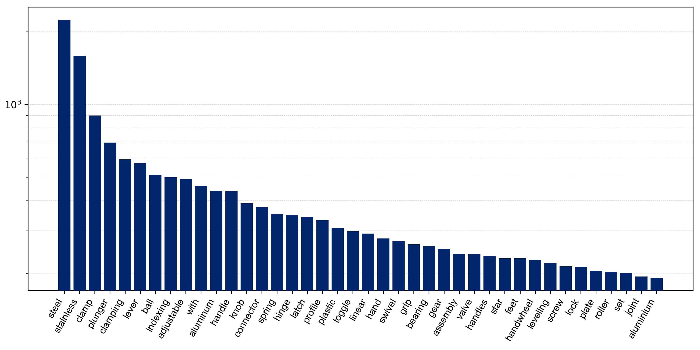
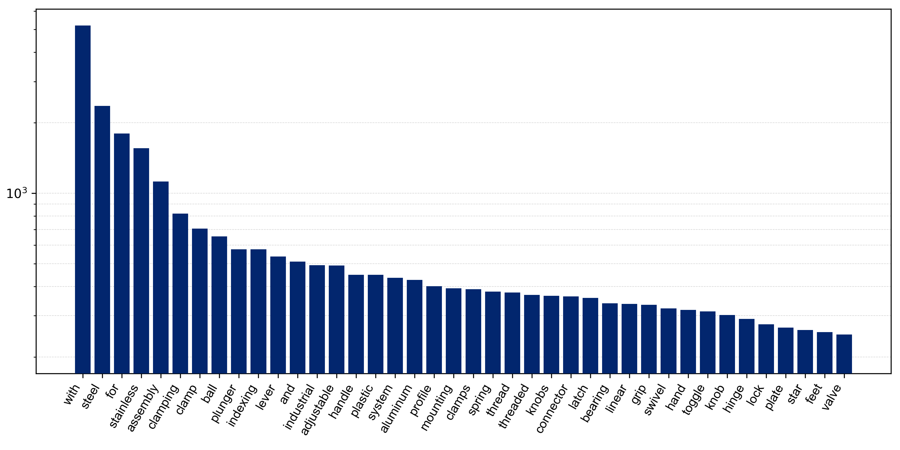
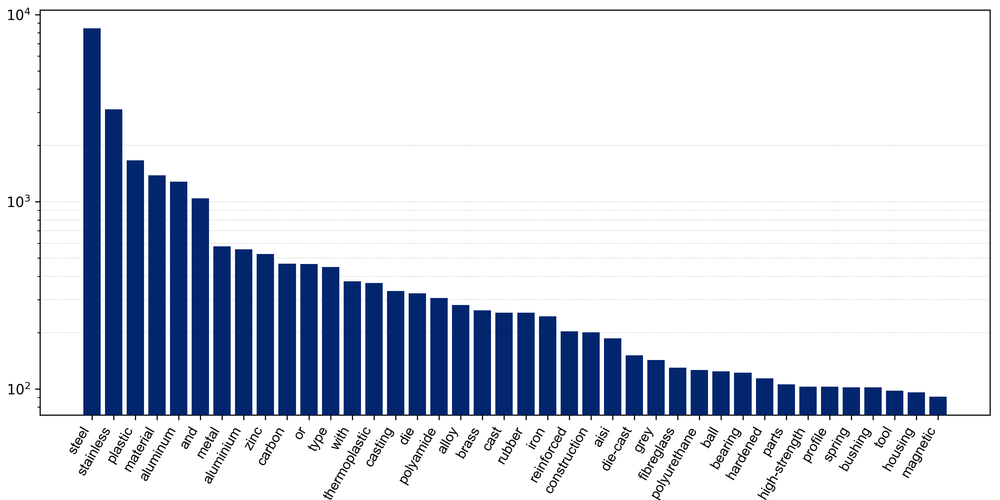

<p align="center">
  
  <h1 align="center">Industrial Language-Image Dataset (ILID)</h1>

  <p align="center">
    <a href="https://www.researchgate.net/profile/Keno-Moenck"><strong>Keno Moenck</strong></a>
    ·
    <a href="mailto:duc.thieu@tuhh.de"><strong>Duc Trung Thieu</strong></a>
    ·
    <a href="https://www.researchgate.net/profile/Julian-Koch-10"><strong>Julian Koch</strong></a>
    ·
    <a href="https://www.researchgate.net/profile/Thorsten-Schueppstuhl"><strong>Thorsten Schüppstuhl</strong></a>
    <br />
    Hamburg University of Technology (TUHH), Institute of Aircraft Production Technology (IFPT), Germany
  </p>

  <h3 align="center">🧾 <a href="https://doi.org/10.1016/j.procir.2024.10.084">10.1016/j.procir.2024.10.084</a></h3>

</p>

<br />

We present the **Industrial Language-Image Dataset (ILID)**, a small and web-crawled dataset containing language-image samples from various web catalogs, representing parts/components from the industrial domain.
Currently, the dataset has `12.537` valid samples from five different web catalogs, including a diverse range of products ranging from standard elements small in size, like hinges, linear motion elements, bearings, or clamps, to larger ones, like scissor lifts, pallet trucks, etc. (s. [Samples](#️-samples) for an excerpt).
In initial [studies](https://doi.org/10.48550/arXiv.2406.09637), we used different transfer learning approaches on [CLIP (Contrastive Language-Image Pretraining)](https://github.com/openai/CLIP) to enable a variety of downstream tasks from classification on object- and material-level to language-guided segmentation. 
The generation of the dataset followed six steps: selecting suitable sources, web crawling, pre-filtering, processing, post-filtering, and a download stage.
We have endeavored to take a step towards the use of VFM in machine vision applications by introducing the ILID to bring the industrial context into CLIP, while also demonstrating the effective self-supervised transfer learning from the dataset in our work.
To date, our studies have only included using three of the five natural language labels, but we encourage you to use or extend the dataset in your own studies for further tasks and evaluation. You can find our training- and evaluation-related code at [kenomo/industrial-clip](https://github.com/kenomo/industrial-clip).

On request, we provide the final post-processed metadata of the dataset to recreate it. Send an email to 📧 [Keno Moenck](mailto:keno.moenck@tuhh.de).

### 💡 Language-guided Segmentation
Language-guided segmentation results given the prompt "collet" and "socket" compared to zero-shot CLIP under the same settings (s. [publication](https://doi.org/10.48550/arXiv.2406.09637) for more model and training details).


### 📈 Word Frequencies

<table>
  <theader>
    <tr>
      <th colspan=3 style="text-align: center;">Top-40 word frequencies</th>
    </tr>
  </theader>
  <tbody>
    <tr>
      <td style="text-align: center;"><i>label_short</i></td>
      <td style="text-align: center;"><i>label_long</i></td>
      <td style="text-align: center;"><i>material</i></td>
    </tr>
    <tr>
      <td></td>
      <td></td>
      <td></td>
    </tr>
  </tbody>
</table>

## 👀 Overview
The dataset has five labels per item, which follows the following structure:

```json
{
  "id": "<<uuid>>",
  "image": "<<label_short>>/<<uuid>>.png",
  "url": "<<original image url>>",
  "label_short": "<<a short label describing the product>>",
  "label_long": "<<a longer label, longer than the short label>>",
  "description": "<<a longer description>>",
  "material": "<<the product's material>>",
  "material_finish": "<<the finish or color of the product>>",
  "source": "<<the source of the sample>>"
}
```

## 🏗 Getting Started
On request, we provide ILID's metadata, which you can use to download the images; the language labels are already included in the provided `json` file. If you want to extend the dataset (add data from additional stores), follow the sections starting from [Writing a spider](#️-writing-a-spider). Otherwise, you can continue downloading the images from the provided ILID `json` file.
The repository contains a `.devcontainer/devcontainer.json`, which contains all the necessary dependencies.

### 📥 Download the ILID
```bash
python download.py \
  --dataset ./data/ilid.json \
  --folder ./data/images \
  --image_width 512 \
  --image_height 512
```

### 🕷️ Writing a Spider
First, identify a suitable web source (and its product `sitemap.xml`) from which to crawl data. With the browser debug console, you can identify the relevant DOM elements from which to yield data. Then, you can use the [Scrapy shell](https://docs.scrapy.org/en/latest/topics/shell.html) to initially access a store and test if you found the correct elements.
```
scrapy shell https://uk.rs-online.com/web/p/tubing-and-profile-struts/7613313
```

Write a spider following the example given in [example/spider.py](example/spider.py). Then, run the spider using:
```
scrapy runspider <<shop>>/spider.py -O data/<<shop>>_raw.json
```

### 💻 Processing Steps
1. Filter the data initially and remove, e.g., tradenames using the regex argument:
```
python pre-filtering.py \
  --file ./data/<<shop>>_raw.json \
  --output ./data/<<shop>>_prefiltered.json \
  --regex "(ameise|proline|basic)"
```
2. Process the data. You need a [Hugging Face Access Token](https://huggingface.co/docs/hub/en/security-tokens) to get access to the `--model "meta-llama/Meta-Llama-3-8B-Instruct"`. If you only want to process a subset of the data, use the `--debug 0.1` argument to process, e.g., only a tenth of the data
```
python processing.py \
  --file ./data/<<shop>>_prefiltered.json \
  --output ./data/<<shop>>_processed.json \
  --access_token "<<huggingface access token>>"
```
3. Apply post-filtering and assemble a combined dataset file from all processed shop data:
```
python post-filtering.py \
  --file ./data/<<shop>>_processed.json \
  --output ./data/<<shop>>_postfiltered.json
python assemble.py \
  --file ./data/<<shop>>_postfiltered.json \
  --dataset ./data/dataset.json \
  --source_tag "<<shop>>"
```
4. Finally, run the `download.py` as described [above](#-download-the-ilid).


## 🖼️ Samples
Some samples from the dataset (source [MÄDLER GmbH](https://www.maedler.de/)):
<table>
  <thead>
    <tr>
      <th>Image</th>
      <th>Language</th>
    </tr>
  </thead>
  <tbody>
    <tr>
      <td></td>
      <td>
        <pre><code class="language-json">{
  "id": "1cc05f06-ff66-49fd-9793-9e0c296cdad0",
  "image": "cylinder_beam_coupling/1cc05f06-ff66-49fd-9793-9e0c296cdad0.png",
  "url": "https://www.maedler.de/Images/250-250/Bilder_Ecomm/Productpics/PH_AC_QM_8010_38.jpg",
  "label_short": "cylinder beam coupling",
  "label_long": "beam coupling for cylinder",
  "description": "Connects cylinders for efficient transmission of force and motion",
  "material": "stainless steel",
  "material_finish": "brushed finish",
  "source": "maedler"
}</code></pre>
      </td>
    </tr>
    <tr>
      <td></td>
      <td>
        <pre><code class="language-json">{
  "id": "de6532e6-474d-4970-94f0-c765bca945ee",
  "image": "acrylic_oil_cylinder_glass/de6532e6-474d-4970-94f0-c765bca945ee.png",
  "url": "https://www.maedler.de/Images/250-250/Bilder_Ecomm/Productpics/Tropfoeler_Glas.jpg",
  "label_short": "acrylic oil cylinder glass",
  "label_long": "spare glass for drip feed oil cylinder",
  "description": "A transparent cylinder made from acrylic glass for use in drip feed oilers",
  "material": "acrylic glass",
  "material_finish": "clear transparent acrylic",
  "source": "maedler"
}</code></pre>
      </td>
    </tr>
    <tr>
      <td></td>
      <td>
        <pre><code class="language-json">{
  "id": "f536e2f4-1edd-43d8-98a9-d9c2a889a8c3",
  "image": "safety_clutch_spring_set/f536e2f4-1edd-43d8-98a9-d9c2a889a8c3.png",
  "url": "https://www.maedler.de/Images/250-250/Bilder_Ecomm/Productpics/Tellerfeder_pack.jpg",
  "label_short": "safety clutch spring set",
  "label_long": "disc spring set for safety clutch",
  "description": "Set of springs for safety clutch applications providing reliable engagement and disengagement",
  "material": "stainless steel material",
  "material_finish": "polished and rust-resistant",
  "source": "maedler"
}</code></pre>
      </td>
    </tr>
    <tr>
      <td></td>
      <td>
        <pre><code class="language-json">{
  "id": "a13a3838-caf2-40e6-a664-61225f7377dc",
  "image": "self-lubricating_chain_link/a13a3838-caf2-40e6-a664-61225f7377dc.png",
  "url": "https://www.maedler.de/Images/250-250/Bilder_Ecomm/Productpics/DIN606_SLR_11.jpg",
  "label_short": "self-lubricating chain link",
  "label_long": "self-lubrication chain connecting link",
  "description": "Similar to DIN ISO standard special chain steel with coated pins for roller chain applications",
  "material": "special chain steel",
  "material_finish": "coated pins",
  "source": "maedler"
}</code></pre>
      </td>
    </tr>
  </tbody>
</table>

## ☎ Contact
You are welcome to submit issues, send pull requests, or share some ideas with us. If you have any other questions, please contact 📧: [Keno Moenck](mailto:keno.moenck@tuhh.de).

## ✍ Citation
If you find __ILID__ useful to your work/research, please cite:
```bibtex
@article{Moenck.2024,
  title = {Industrial {{Language-Image Dataset}} ({{ILID}}): {{Adapting Vision Foundation Models}} for {{Industrial Settings}}},
  author = {Moenck, Keno and Thieu, Duc Trung and Koch, Julian and Sch{\"u}ppstuhl, Thorsten},
  year = {2024},
  journal = {Procedia CIRP},
  series = {57th {{CIRP Conference}} on {{Manufacturing Systems}} 2024 ({{CMS}} 2024)},
  volume = {130},
  pages = {250--263},
  issn = {2212-8271},
  doi = {10.1016/j.procir.2024.10.084}
}

@misc{Moenck.14.06.2024,
  author = {Moenck, Keno and Thieu, Duc Trung and Koch, Julian and Sch{\"u}ppstuhl, Thorsten},
  title = {Industrial Language-Image Dataset (ILID): Adapting Vision Foundation Models for Industrial Settings},
  date = {14.06.2024},
  year = {2024},
  url = {http://arxiv.org/pdf/2406.09637},
  doi = {https://doi.org/10.48550/arXiv.2406.09637}
}
```
